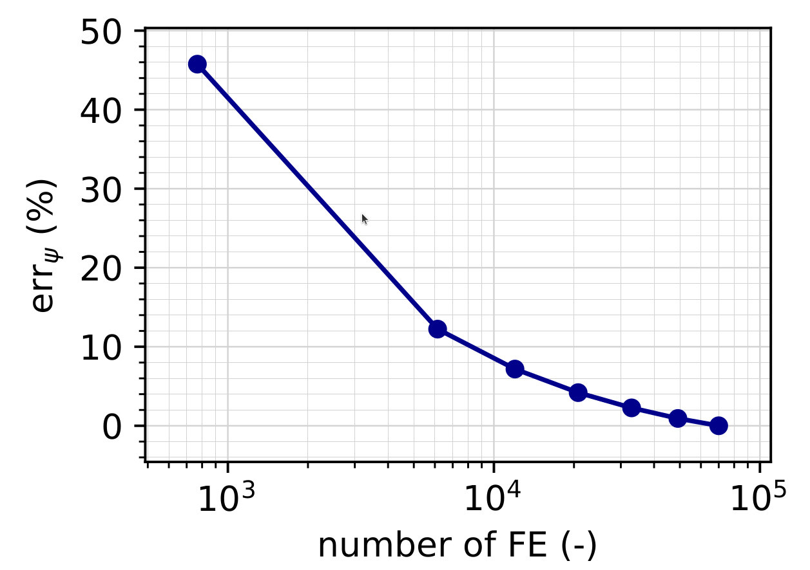

## Application of Thermodynamics-based Artificial Neural Networks (TANN):

In this application we will see how to use user-materials derived from artificial neural networks, and more precisely Thermodynamics-based Artificial Neural Networks (TANN), within Numerical Geolab.
We will see the steps necessary to set the finite element formulation and the boundary value problem, with particular attention on how the user-material is imported and the coupling with tensoflow.
The application consists of a 3D model subjected to torsional deformations. The material used represents the volume average behavior of a lattice microstructure with bars displaying elasto-plastic rate-independent behavior, with von Mises yield criterion, and kinematic hardening. For more, we refer to [1]_, [2]_ .

[1] Masi, F., Stefanou, I., Vannucci, P. and Maffi-Berthier, V., 2021. Thermodynamics-based Artificial Neural Networks for constitutive modeling. Journal of the Mechanics and Physics of Solids, 147, p.104277. doi: [10.1016/j.jmps.2020.104277](https://doi.org/10.1016/j.jmps.2020.104277)

[2] Masi, F. and Stefanou, I., 2022. Multiscale modeling of inelastic materials with Thermodynamics-based Artificial Neural Networks (TANN). Computer Methods in Applied Mechanics and Engineering, 398, p.115190.  doi: [10.1016/j.cma.2022.115190](https://doi.org/10.1016/j.cma.2022.115190)

### Begining of file


The file begins as follows:
   
	import os # allows for easier handling of paths
	os.environ['TF_CPP_MIN_LOG_LEVEL'] = '2' # INFO and WARNING messages are not printed 
	# = '0' all messages are logged (default behavior)
	# = '1' INFO messages are not printed
	# = '3' INFO, WARNING, and ERROR messages are not printed
	import tensorflow as tf
	
	from dolfin import *
	import numpy as np
	from ngeoAI.AI_material import AIUserMaterial3D # import material library based on Neural Network models
	from ngeoFE.feproblem import UserFEproblem, General_FEproblem_properties
	from ngeoFE.fedefinitions import FEformulation
	import pickle # allows export of the results 
	material_folder = "../../../numerical_geolab_materials/UMATERIALS/TANN_material" # folder of the saved Neural Network
	reference_data_path = "./results/"
	
| We define the FE model dimensions and number of elements along each axis (x,y,z).
   
	# Define FE model dimensions (x,y,z)
	lx, ly, lz = 10., 10., 20.
	# Define number of FE (x,y,z)
	nx, ny, nz = 12, 12, 24
   
### Finite element formulation


| In order to continue we need to provide the form of the test function to be used together with the interpolation function (solution) to be used in the specific problem's weak formulation. 
We do this by specifying the number of vector components for the test function, the interpolation function used inside the element and the number Gauss points present in the element for the integral evaluation
of the weak form

Below, we provide the finite element formulation for the problem at hand

    
    class AI3DFEformulation(FEformulation):
    '''
    Defines a user FE formulation
    '''
    def __init__(self):
        # Number of stress/deformation components
        self.p_nstr=6
        # Number of Gauss points
        self.ns=1

    def generalized_epsilon(self,v):
        """
        Set user's generalized deformation vector
        """
        gde=[
            Dx(v[0],0),                 #gamma_11
            Dx(v[1],1),                 #gamma_22
            Dx(v[2],2),                 #gamma_33
            Dx(v[1],2)+Dx(v[2],1),      #gamma_23
            Dx(v[0],2)+Dx(v[2],0),      #gamma_13
            Dx(v[0],1)+Dx(v[1],0),      #gamma_12
            ]
        return as_vector(gde)
    
    def create_element(self,cell):
        """
        Set desired element
        """
        # Defines a Lagrangian FE of degree 1 for the displacements
        element_disp=VectorElement("Lagrange",cell,degree=1,dim=3)
        return element_disp  
        
| Our problem is a 3D problem involving a classical Cauchy continuum. Note that a Voigt notation is used for the unknown strains.
The class is initialized with 6 strain components and 1 Gauss point. The python function:

```generalized_epsilon(v)```
   
| presents the derivatives of the vector components of the Testfunction according to the Voigt formulation. The notation used by the dolfin package indicates that Dx(v[i],j) is the derivative of the vector component (i) of the Testfunction (v), w.r.t. the spatial direction (j). The Testfunction is an object of the dolfin package available in the FeniCs documentation. The python function:

```create_element(cell)```
   
   
| sets the desired element from the dolfin library of finite elements. Here a two dimensional (dim=3) linear (degree=1) VectorElement() is used. The VectorElement() class is documented in the dolfin finite element package of FeniCs.
We note here that the VectorElelement() class indicates that the components of the function space for each vector component are the same.

#### Boundary identification


We proceed now by identifying the boundaries needed for the application of the boundary conditions at a later stage of the modeling procedure.
We make use of the SubDomain() parent class inside dolfin:

```SuDomain(x,on_boundary)```

We create one subclass of the class for the bottom surface, which inherits from it the spatial variable (x) and the boundary identification flag (on_boundary) and the method

```inside(x,on_boundary)```

The subclasses are defined as follows:

   
   class top(SubDomain):
    def inside(self,x,on_boundary):
        return abs(x[2] - lz)<=DOLFIN_EPS_LARGE
  
	class bottom(SubDomain):
	    def inside(self, x, on_boundary):
	        return abs(x[2] - 0.)<=DOLFIN_EPS_LARGE
    
   
Inside the subclass we define the logical test for assigning the specific boundary node in one of the boundary regions, where the boundary conditions will be applied.
The value x[i] indicates the spatial coordinate :math:`x_i` of the problem at hand, here z-axis.


### Finite element problem description


We proceed by building the main Finite Element model, corresponding to a torsional defomation of a 3D prism characterized by a multiscale elasto-plastic material.
The finite element model is built inside a child class that inherits its methods from the parentclass UserFEproblem(). We will provide here commentary for each method used inside the childclass FEproblem(UserFEproblem).


   class FEproblem(UserFEproblem):
    """
    Defines a user FE problem for given FE formulation
    """
    def __init__(self,FEformulation):
        self.description="Example of 3D FE application with TANN"
        # Attributes: FE model dimensions (dir: x,y,z)
        self.lx, self.ly, self.lz = lx, ly, lz
        # Attributes: number of FE (dir: x,y,z)
        self.nx, self.ny, self.nz = nx, ny, nz
        
        super().__init__(FEformulation)
        
In the class __init__() method, the finite element formulation defined above is provided as argument. The geometric dimensions of the problem are identified as attributes of the subclass.
The initialization then proceeds to set up all the methods of the parentclass UserFEproblem(). The methods inside the class are defined by overriding the methods inside the parent class. 

``` { .python }

    def set_general_properties(self):
        """
        Set here all the parameters of the problem, except material properties 
        """
        self.genprops = General_FEproblem_properties()
        # Number of internal state variables of the thermodynamic formulation
        self.p_nIsvars = 22
        # Total number of state variables
        self.genprops.p_nsvars = 14 + self.p_nIsvars
```
This method is used to provide the number of state variables of the material. In this tutorial only the mechanical behavior is important 
and therefore, the state of material is described by the increment of stress, total strain, internal state variables, and (not required for the solution of the problem) the elastic energy density and dissipation rate density.
The internal state variables represents here state variables describing irreversible processes happening within the miccrostructure of the material. For more, see [2]_.

| Next we continue by generating the mesh for the problem at hand. The structure is modeled as a prism of dimensions :math:`10 \times 10 \times 20` ( :math:`l_x \times l_y \times l_z`).
For this simple geometry the capabilities of dolfin can be used to define a tetrahedral mesh specifying the domain's dimensions and the number of elements.

    def create_mesh(self):
        """
        Set mesh and subdomains 
        """
        # Generate mesh       
        mesh=BoxMesh(Point(-.5*self.lx,-.5*self.ly,0*self.lz),
                     Point(.5*self.lx,.5*self.ly,1.*self.lz),
                     self.nx,self.ny,self.nz)
        cd=MeshFunction("size_t", mesh, mesh.topology().dim())
        fd=MeshFunction("size_t", mesh, mesh.topology().dim()-1)
        return mesh,cd,fd

For the domain at hand we specify a discretization with nx=ny=12 elements along x[0] and x[1] components and nz=24 elements along the x[2] component. The MeshFunction() method of dolfin is used to provide the mesh object, the interior domain and the boundary domains. The following model is the produced:

.. figure:: _images/mesh_AI.png
         :height: 295 px
         :width: 379 px
         :alt: alternate text
         :align: center
         
         Image of the mesh produced by BoxMesh(). The domain was exported with the help of the third party software Paraview.

We next assign values to the regions of the mesh defined by different material properties. 
    
    def create_subdomains(self,mesh):
        """
        Create subdomains by marking regions
        """
        subdomains = MeshFunction("size_t", mesh, mesh.topology().dim())
        subdomains.set_all(0) 
        return subdomains
        
In this tutorial all the domain is defined by the same material properties and therefore the value 0 will be assigned everywhere inside the mesh.
This value is a number indicating which material parameters need to be taken into account in each mesh region (see the corresponding method set_material_params()).

| We continue by marking the boundaries of the model based on the classes defined during the boundary identification phase (see section :ref:`Boundary identification` above).
The assignement follows a numeric order, by assigning the numbers 1 to 6, to specify different regions of the model and using the method mark() from the SubDomain() class of dolfin.

    def mark_boundaries(self,boundaries):
        """
        Mark boundaries
        """
        boundaries.set_all(0)
        fc={"top":1,
            "bottom":2,
            "left":3,
            "right":4,
            "back":5,
            "front":6,} 
        
        self.fc=fc
        
        top0=top()
        top0.mark(boundaries,fc["top"])
        bottom0=bottom()
        bottom0.mark(boundaries,fc["bottom"])
        return 

Assigning boundary conditions
*****************************

We are now able to identify the boundaries of the mesh and assign different boundary condition to each side of the boundary. 

    def set_bcs(self):
        """
        Set boundary conditions for the user problem / could be replaced by external mesher, e.g. Abaqus, Gmsh...
        """
        BC_DC=self.BCtype["DC"]
        fc=self.fc
        bcs = [[fc["bottom"], [BC_DC, [0], 0.]],
               [fc["bottom"], [BC_DC, [1], 0.]],
               [fc["bottom"], [BC_DC, [2], 0.]]
               ]
        theta = np.radians(30.) # torsional angle
        bcs.extend(self.set_torsion_bcs(theta,[0,0,self.lz])) # torsional bcs
        return bcs
         
Inside this method the boundaries are assigned with the use of a nested list. Dirichlet, Neuman and Robin boundary conditions can be applied 
both incrementaly and instantaneously. The boundary conditions can be assigned to a boundary region or pointwise. 

| The nested list contains the following information:

| [region id, [type of bc, vector component ,value]]

In this example, the region id is 2 (fc["bottomo"]), indicating the bottom region of the boundaries. The type of bc is set to Dirichlet. The vector component shows which component of the 3D displacement vector is to be affected and value 
indicates the value of the boundary condition to be set at the specific boundary. Here, the bottom region is completely fixed. 
In addition, we impose displacement fields at the top region of the model using a user-defined function which apply torsional displacements along the z axis (i.e. [2]) according to the angle of rotation and the center of rotation. The function is defined below:

    def set_torsion_bcs(self,theta,center):
        """
        Set displacement boundary conditions under torsion of angle = theta and center of rotation = center
        
        :param theta: rotation angle (radians) - input
        :type double
        :param center: center of rotation - input
        :type numpy array
        
        :return: boundary conditions for torsional displacement
        :rtype: list
        """
        hv = center[2]
        coords = self.mesh.coordinates()
        coords = coords[abs(coords[:,2]-self.lz)<DOLFIN_EPS_LARGE]
        
        bcs=[]
        for pt in coords:
            pt[0:1]=pt[0:1]-center[0:1]
            u0 = pt[0] * (np.cos(theta)-1)  -  pt[1] * np.sin(theta)
            u1 = pt[0] * np.sin(theta)      +  pt[1] * (np.cos(theta)-1)
            
            bc=[[[100,[pt[0],pt[1],pt[2]]] , [self.BCtype["DC"],[0],u0] ],
                [[100,[pt[0],pt[1],pt[2]]] , [self.BCtype["DC"],[1],u1]],
                ]
            bcs.extend(bc)
        return bcs

The function first identifies all nodes with vertical component equal to the z component of the center of rotation (=coords).  Then, using a for loop, a list of boundaries is filled. For each node, the function applies Dirichlet boundary conditions for the region identified by the coordinates of the node. The displacements are computed by means of trigonometric functions:

:math:`u_1 = \left( \cos \theta -1 \right)x_1+ \left(\sin \theta \right)x_2`

:math:`u_2 = \left( \sin \theta \right)x_1+ \left(\cos \theta -1\right)x_2`

Notice that we want to apply nodal displacements depending on the position of the nodes themselves. Thus, the nested list of prescribed boundary conditions need to have a region_id such that len(region_id)=2, as specified in

``` __get_BC_point_or_facet(self,region_id,sV,bc_value)```

To avoid confusion with boundary condition IDs, we set the region id = [100, [pt[0],pt[1],pt[2]]]. Note that the value of region_id[0] is not important and can be any. The important parameter to be specified is region_id[1] comprosing a nested list of the position [:math:`x_1`, :math:`x_2`, :math:`x_3`] of the applied displacement.

#### Material specification

Next, we define the analysis material that we have already assigned in the create_subdomains() method.

    def set_materials(self):
        """
        Create material objects and set material parameters
        """
        mats=[]
        annmat = AIUserMaterial3D(material_folder,self.p_nIsvars)
        mats.append(annmat)
        return mats

At the beginning of the file, we defined the material_folder, this is the relative folder where the material can be found. In this application, the material is an Artificial Neural Network (ANN), which uses tensorflow library, trained to predict the behavior of a microstructured lattice material, whose constituents display a rate-independent elasto-plastic behavior with von Mises yield criterion and kinematic hardening. The ANN, available at material_folder, is the so-called Thermodynamics-based Artificial Neural Network. However, notice that any other type of ANN can be preferred. The only prerequisite is that the ANN takes as input the vector of state variables and the generalized strain increment vector.

Being the ANN already trained, no material properties need to be defined. 

#### Analysis execution


Our model is now set and ready to run.
The following code block provides the initialization of AI3DFEformulation() and FEproblem() subclasses. We specify the solver total analysis time and the path at which the results will be saved.
Then, FEproblem.solve() calls the solution of the boundary value problem.

   FEformulation = AI3DFEformulation()
   FEproblem = FEproblem(FEformulation)
   FEproblem.slv.tmax=1.
   saveto=reference_data_path+"AI_model_results.xdmf"
   converged=FEproblem.solve(saveto,silent=False,summary=False)

#### Export the results


Next, we can export the results as numpy arrays to be read and post-processed. The results comprise the nodal displacements (uN), the stress and state variables are the Gauss integration points (stressGP, svarsGP).
The arrays are assembled in a list which is then exported using pickle.

    # Export results as numpy arrays
	uN = FEproblem.feobj.usol.vector().get_local()
	stressGP = np.reshape(FEproblem.feobj.sigma2.vector().get_local(),(-1,FEproblem.feobj.p_nstr))
	svarsGP = np.reshape(FEproblem.feobj.svars2.vector().get_local(),(-1,FEproblem.feobj.p_nsvars))
	outputs = [uN,stressGP,svarsGP]
	
	w_in_file = reference_data_path+"AI_results"
	with open(w_in_file, 'wb') as f_obj:
	    pickle.dump(outputs, f_obj)
|

#### Mesh sensitivity analyses and results
 

To investigate the convergence of the Finite Element model with respect to the size of the elements, we perform a convergence analysis by varying the values of the elements's size defined at the beginning of the file (nx, ny, nz).
The convergence is evaluated in terms of the relative percentage error of the total energy. The total energy is simply computed by summing the energy densities of all Gauss point and multiplying by the element size. 
From the analysis, we can observe that a mesh with 12x12x24 yields a relative error in the energy less than 5%.



         
         Relative percentage error of the total energy with respect to the number of elements. 

Below, we can observe torsional warping, i.e., the tendency of the structure to have non-zero vertical displacements due to the torsional deformation. 

.. figure:: _images/displacement_vertical_AI.png
         :height: 295 px
         :width: 379 px
         :alt: alternate text
         :align: center
         
         Torsional warping: vertical displacement field due to a torsional deformation. The displacement fields were exported with the help of the third party software Paraview.

